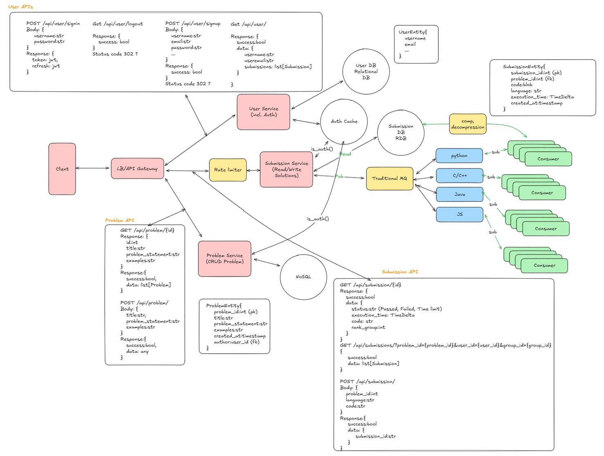

# lc
Design LC

This app is to clone Leetcode system from the system design perspective

Basic Functional requirement might be,
1. Login / Auth using JWT
2. CRUD of Problem
3. Submission of the solution and reading its status

Initial design might be like below which is only focusing on Functional requirements

